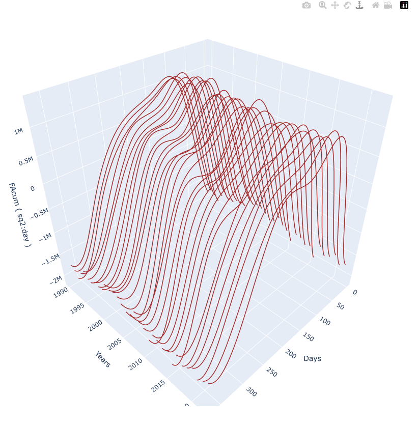

# DiffRules    
Derivative method to solve or visualize tabular data using cubic spiline.   
In Development.   
Data from NCID (NASA gov US) -- Climate (Sea Ice Extent)     
Credits    
Alglib, FluentFtp, MS Data Analysis, Plotly[.Net]    

